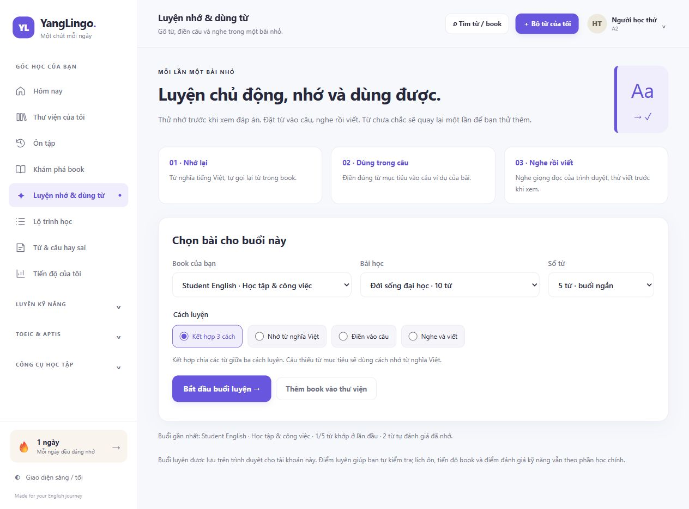

# YangLingo

**Học tiếng Anh theo bài ngắn, luyện nhớ chủ động và ôn đúng lúc.**

YangLingo is a PHP and MySQL English-learning web application. It brings vocabulary books, spaced review, contextual practice and an explainable daily study plan into one place.

[Trải nghiệm bản demo](https://yangcute.helioho.st/) · [Tổng quan dự án](docs/PROJECT_OVERVIEW.md) · [Kiến trúc](docs/ARCHITECTURE.md)



Người xem demo có thể **tự đăng ký tài khoản riêng** để trải nghiệm. Thông tin tài khoản cá nhân và cấu hình hosting không nằm trong repository này.

## Bài toán

Người học thường lưu từ vựng ở một nơi, làm bài luyện ở nơi khác rồi bỏ quên những câu đã sai. YangLingo nối các bước đó: chọn một bài vừa sức, tự nhớ lại trước khi xem đáp án, luyện từ trong ngữ cảnh và quay lại ôn khi đến hạn.

## Những gì đã triển khai

- **Thư viện flashcard theo book và bài:** nghĩa Việt, ví dụ Anh–Việt, ghi chú cách dùng và lịch ôn SRS riêng. Book đóng gói được nhận diện theo nguồn để tránh tạo lại book và reset tiến độ khi đồng bộ.
- **Student English · Học tập & công việc:** book riêng gồm **120 thẻ / 12 bài / 10 thẻ mỗi bài**, từ giảng đường và bài nhóm đến email, thực tập, phỏng vấn, quản lý thời gian và đời sống số. Mỗi bài có mục tiêu và gợi ý luyện nói. A2–B1 là mức gợi ý biên soạn.
- **Daily Essentials · 64 từ & cụm dùng ngay:** book riêng **8 bài × 8 thẻ** cho lớp học, ở chung, đi chợ, đi xe và nhắn tin. Có ví dụ Anh–Việt, ghi chú cách dùng và gợi ý nói; 39 từ đơn có IPA Anh–Mỹ được ghi nguồn. [Nội dung và cách học](docs/DAILY_ESSENTIALS.md).
- **English for Web · Đọc tài liệu & làm việc nhóm:** book riêng **6 bài × 8 thẻ**, có 48 nhiệm vụ tự viết câu cho tình huống đọc tài liệu, HTTP, tài khoản, tệp, báo lỗi và làm việc với thay đổi mã. 20 từ đơn có IPA US được ghi nguồn; bài gõ/nghe chỉ mở đáp án sau khi kiểm tra hoặc chủ động xem. [Nội dung, cách học và giới hạn](docs/WEB_ENGLISH48.md).
- **Phiên âm dưới từ:** hiển thị nguyên IPA và nhãn US/UK đã lưu, giữ ký hiệu của thẻ cũ. Bài gõ/nghe chỉ hiện IPA sau khi kiểm tra hoặc xem đáp án; ký hiệu IPA dạng `/.../` nhận diện được trong nghĩa cũ cũng được che ở phần gợi ý. [Nguồn, phiên bản và giấy phép](pronunciation-sources.html) được đóng gói riêng; không tải toàn bộ từ điển hay tệp âm thanh.
- **Nhãn thẻ rõ ràng:** phân biệt từ vựng, cụm từ, cấu trúc câu, ngữ pháp và bài nghe trong lượt ôn, giúp người học hiểu mình đang cần nhớ từ hay cả cách dùng.
- **Đọc lại một thẻ trong thư viện:** bấm vào từ hoặc câu để mở nghĩa, IPA đã lưu, ví dụ Anh–Việt và ghi chú cách dùng. Nghe riêng từ hoặc câu ví dụ; **Ghi câu của tôi** mở nháp sổ tay có tham khảo và ô tự viết để trống, chỉ lưu khi bạn bấm Lưu ghi chú. Xem thẻ không thay đổi lịch ôn hay kết quả học. [Cách dùng](docs/CARD_DETAILS.md).
- **Sổ tay & cách học:** ghi chú riêng theo tài khoản, câu tự viết, tìm kiếm, ghim, lưu trữ và khôi phục. Tám mục hướng dẫn ngắn có câu tự kiểm tra và nguồn tham khảo; đáp án mở sau khi người học bấm xem. [Cách dùng và giới hạn](docs/LEARNING_NOTEBOOK.md).
- **Ba cách luyện từ:** nhớ từ nghĩa Việt, điền từ vào câu, nghe rồi viết. Chọn 5 hoặc 10 thẻ, phối hợp cả ba cách, xem giải thích và thử lại từ chưa nhớ. Âm thanh dùng giọng đọc của trình duyệt; thiết bị chưa hỗ trợ chuyển sang luyện nhớ từ.
- **Thử dùng từ trong 30 giây:** gợi ý, câu mẫu, đồng hồ và tự kiểm tra giúp người học nói về tình huống của mình. Phần này không chấm phát âm. Kết quả buổi luyện từ lưu trong trình duyệt theo tài khoản; lịch SRS cập nhật qua luồng ôn bài.
- **Kế hoạch hôm nay, Mistake Book và phân tích điểm yếu:** ưu tiên thẻ đến hạn, học lại và lỗi tái diễn trước khi thêm kiến thức, kèm lý do cho người học.
- **Luyện TOEIC và Aptis:** các dạng câu hỏi, lịch sử làm bài và kiến thức liên quan; phần nói và viết Aptis có công cụ thực hành, tự đánh giá.
- **Tài khoản và quản trị:** đăng ký, đăng nhập, phân quyền, quản lý nội dung, import TXT/CSV/XLSX/DOCX. Giao diện dùng trên điện thoại; PWA lưu phần giao diện ngoại tuyến.

Daily Plan dùng **quy tắc có thể giải thích**, không phải mô hình học máy. Kết quả luyện và tự đánh giá không phải điểm thi chính thức. Chưa có nghiên cứu với nhóm người học để khẳng định mức tăng điểm hay hiệu quả ghi nhớ.

## Công nghệ và cấu trúc

Ứng dụng chạy bằng **PHP 8.0+**, **MySQL/MariaDB**, PDO, JavaScript và CSS thuần. Node.js chỉ phục vụ kiểm tra JavaScript khi phát triển. Tích hợp AI qua cấu hình là tùy chọn; thư viện và luyện tập hoạt động khi không có khóa AI.

| Thành phần | Vai trò |
| --- | --- |
| `index.php`, `assets/` | Giao diện, điều hướng, bài luyện và tài nguyên tĩnh |
| `api.php` | API JSON, đăng nhập, CSRF và phân quyền |
| `lib/` | Dữ liệu, xác thực, SRS, Daily Plan và bộ đọc import |
| `database/schema.sql` | Cấu trúc nền cho database mới |
| `database/migrations/` | Migration chạy theo thứ tự tên, có checksum |
| `database/seeds/` | Học liệu chung, được theo dõi riêng bằng checksum |
| `assets/flashbooks/` | Nguồn các book đóng gói và học liệu English bổ sung |
| `templates/`, `tests/`, `docs/` | Mẫu import, kiểm tra và tài liệu |
| `storage/`, `uploads/` | Dữ liệu lúc chạy; Git chỉ giữ tệp bảo vệ thư mục |

## Chạy trên máy cục bộ

PHP cần bật `pdo_mysql` và `mbstring` để chạy thiết lập. Cần database MySQL/MariaDB mới và tài khoản có quyền tạo/thay đổi bảng, tạo bảng tạm, đọc/ghi dữ liệu. PHP cần quyền ghi cấu hình cục bộ và `storage/` khi thiết lập.

1. Tải hoặc clone repository; tạo một **database trống** cho YangLingo.
2. Sao chép `config.example.php` thành `config.local.php`. Điền `app_url` là `http://127.0.0.1:8080` và thông tin database cục bộ. Để `openrouter_api_key` trống nếu không dùng AI. Git bỏ qua `config.local.php`.
3. Trong thư mục dự án, khởi động máy chủ phát triển:

   ```bash
   php -S 127.0.0.1:8080
   ```

4. Mở `http://127.0.0.1:8080/setup.php`. Nhập cùng thông tin database, URL cục bộ và tài khoản quản trị **do bạn tự chọn**. Thiết lập ghi cấu hình, áp dụng schema, migration và content seed, tạo quản trị viên rồi ghi `storage/installed.lock` để khóa thiết lập.
5. Mở `http://127.0.0.1:8080/`, đăng nhập hoặc đăng ký người học riêng. Vào Thư viện, chọn book và thử luyện từ.

`lib/bootstrap.php` cũng gọi `Database::ensureSchema()` khi khởi động. Bộ chạy áp dụng các tệp `.sql` trong migration và seed theo thứ tự tên; tệp đã được ghi nhận sẽ không chạy lại. CSV/JSON là nguồn học liệu hoặc báo cáo, không tự được thực thi như SQL.

`database/seed.sql` là bộ từ mẫu tùy chọn, **không tự chạy**; nếu cần, chạy thủ công sau khi đã có quản trị viên. Chi tiết: [Database Migration Guide](DATABASE_MIGRATION_GUIDE.md).

Bản công khai đã thay định danh cá nhân trong migration 009 bằng dữ liệu mẫu và thêm điều kiện bỏ qua thao tác khi người học mẫu chưa tồn tại. Checksum tệp khác bản triển khai cũ, nên hướng dẫn này dành cho **cài đặt mới**. Với database đang dùng, giữ lịch sử migration của hệ thống đó và dùng migration mới cho thay đổi tiếp theo.

## Kiểm tra

Một số kiểm tra không cần database:

```bash
php tests/student_life_work_book_test.php
php tests/everyday_english_book_test.php
php tests/daily_essentials_book_test.php
php tests/web_english_book_test.php
php tests/srs_test.php
php tests/adaptive_test.php
php tests/importer_test.php
php tests/migration_audit_test.php
php tests/static_audit.php
node --check assets/practice-lab.js
node tests/learning_ux_test.cjs
node tests/pronunciation_ux_test.cjs
node tests/notebook_navigation_test.cjs
node tests/practice_state_test.cjs
node tests/card_details_test.cjs
node tests/card_notebook_test.cjs
node tests/notebook_api_retry_test.cjs
```

Cài đặt mới của bản công khai v49 đã được kiểm tra với PHP 8.0.30/PDO và MariaDB 10.4.32: **15 migration, gồm migration 009 và sổ tay 016, cùng 12 SQL content seed chạy thành công** trên database trống trước khi tạo tài khoản. Chạy lại schema và khởi động ứng dụng không nhân đôi dữ liệu; sổ tay lưu và đọc lại tiếng Việt đúng. Kiểm tra catalog trước đó đã cài đủ 13 book: Everyday English có 60 thẻ, Student English có 120 thẻ; đồng bộ lại giữ nguyên book/thẻ/SRS của dữ liệu kiểm tra.

Chi tiết thẻ có 60 kiểm tra hành vi trên các hàm giao diện thật: ký hiệu HTML hiển thị như văn bản, dữ liệu theo tài khoản, phản hồi đến muộn, đóng/thay thế hộp thoại, bàn phím và không ghi tiến độ khi đọc. Bản thử dữ liệu hư cấu đã được xem trên màn hình máy tính và 375 px, gồm từ, cụm từ, ngữ pháp, câu nghe và nội dung dài. Những kiểm tra này không khẳng định đã bao phủ mọi trình đọc màn hình hoặc giọng đọc của thiết bị.

Kiểm tra tích hợp bằng `php tests/db_integration_test.php` cần cấu hình trỏ đến database thử nghiệm riêng; có thể áp dụng schema/migration/seed. Báo cáo lịch sử ở `TEST_REPORT.md` và `docs/` ghi phạm vi của từng phiên bản. Các kết quả này kiểm tra phần mềm, không đo mức tiến bộ tiếng Anh của người dùng.

Daily Essentials có **41 kiểm tra tích hợp thực** trên database MariaDB riêng: catalog chỉ đọc, book 64 thẻ/8 bài, nội dung bài và gợi ý nói, cài lặp/cài đồng thời giữ cùng ID, phân biệt tài khoản và giữ dữ liệu cũ. Chạy `php tests/daily_essentials_install_test.php` với `YL_TEST_CONFIG_PATH` trỏ tới một tệp cấu hình thử nghiệm cục bộ; tên database phải kết thúc bằng `_qa` hoặc `_test`. Kiểm tra tạo tài khoản hư cấu riêng rồi dọn chúng bằng ID và email; không chạy với cấu hình host thật.

Kiểm tra hồi quy loại thẻ bằng `php tests/card_type_preservation_test.php` dùng các biến môi trường `YL_TEST_DB_HOST`, `YL_TEST_DB_PORT`, `YL_TEST_DB_NAME`, `YL_TEST_DB_USER`, `YL_TEST_DB_PASS`. Database phải nằm trên máy cục bộ, có schema hiện hành và tên kết thúc bằng `_qa` hoặc `_test`. Kiểm tra không đọc cấu hình production; dữ liệu thử nằm trong transaction và được rollback. Phạm vi: tạo/chỉnh sửa cả 7 loại thẻ, giữ audio và định danh, từ chối chủ sở hữu khác. Bản v44 sửa lỗi thẻ `LISTENING` bị chuẩn hóa thành từ vựng khi lưu; biểu mẫu hiển thị nhãn tiếng Việt với đúng giá trị loại thẻ.

Sổ tay có kiểm tra tích hợp tại `tests/notebook_integration_test.php`, cần biến môi trường `YANG_NOTEBOOK_TEST_CONFIG` trỏ đến cấu hình database thử riêng trên máy, tên kết thúc `_qa` hoặc `_test`. Kiểm tra 115 hành vi DB/HTTP bao gồm quyền sở hữu, CSRF, validation, tìm ký hiệu theo nghĩa chữ, phân trang, lưu trữ/khôi phục và hai lần tạo đồng thời khi đã có 499 ghi chú. Dữ liệu mẫu được dọn; phần kiểm tra không tạo tiến độ SRS. Chi tiết cấu hình nằm trong đầu tệp kiểm tra. Giao diện đã được thử tạo/sửa/tải lại, ghi ký hiệu HTML như văn bản, tìm kiếm, ghim, lưu trữ/khôi phục, mở đáp án hướng dẫn và bố cục điện thoại.

Bước ghi câu từ thẻ có 83 kiểm tra trên module thật và 6 kịch bản API làm mới phiên rồi thử lại. Kiểm tra chặn gửi nháp sang tài khoản khác, biểu mẫu đã thay hoặc trang đã rời; chỉ lưu khi người học gửi biểu mẫu, giữ nháp khi gặp lỗi và không xoá nhầm biểu mẫu mở sau. Bản thử hư cấu đã kiểm tra huỷ, lưu, tách tài khoản và bố cục 375 px. Phần máy chủ sổ tay không thay đổi trong bản này.

English for Web có 81 kiểm tra nội dung/bộ đọc, gồm 22 trường hợp dữ liệu không hợp lệ, và 46 kiểm tra tích hợp trên MariaDB riêng. Kiểm tra thêm lần đầu/lặp/đồng thời, tách tài khoản, nhóm bài 6 × 8, nhiệm vụ viết câu, thời lượng gợi ý và giữ nguyên dữ liệu cũ. Bộ kiểm tra dùng `php tests/web_english_install_test.php` với `YL_TEST_CONFIG_PATH` trỏ đến cấu hình database thử riêng, tên kết thúc `_qa` hoặc `_test`; nó tạo và dọn tài khoản hư cấu, không dùng cấu hình hosting thật. Giao diện dữ liệu hư cấu đã được kiểm tra trên điện thoại: bài nghe/nhớ không lộ đáp án sớm, chi tiết thẻ hiện nghĩa/ví dụ/ghi chú/nhiệm vụ, nháp sổ tay để trống câu tự viết.

## Bảo mật và dữ liệu

Mã nguồn có password hashing, giới hạn thử đăng nhập, phiên phía máy chủ, CSRF, phân quyền và truy vấn PDO có tham số. Dữ liệu học cá nhân gắn với chủ sở hữu. Import giới hạn kích thước/số phần tử và kiểm tra đường dẫn trong archive. Chi tiết: [SECURITY.md](SECURITY.md).

Repository không bao gồm cấu hình thật, database export, phiên đăng nhập, tệp người dùng tải lên hoặc bản sao lưu production. `.htaccess` bảo vệ các thư mục nội bộ trên Apache; triển khai bằng máy chủ khác cần các quy tắc tương ứng.

## Giấy phép và học liệu

Giữ nguyên [LICENSE](LICENSE) MIT đã có. PDF/Google Sheet được cung cấp trước đó có nguồn ghi trong tài liệu; không mặc nhiên coi mọi học liệu bên ngoài là MIT. Xem [nguồn và giấy phép học liệu](docs/CONTENT_LICENSES.md) và [manifest bản công khai](docs/PUBLIC_SOURCE_MANIFEST.json).

IPA bổ sung dùng dữ liệu General American của [IPA-dict](https://github.com/open-dict-data/ipa-dict), nguồn chuyển đổi cmudict-ipa và đối chiếu CMUdict. Giữ đủ thông báo giấy phép MIT/CMU trong `assets/licenses/`, cùng phiên bản nguồn ở [trang ghi nguồn](pronunciation-sources.html). Bản công khai không chứa database hay kế hoạch chỉnh thẻ riêng của người dùng.

TOEIC và Aptis mô tả dạng luyện tập; YangLingo không phải dịch vụ thi hoặc chấm điểm chính thức.
