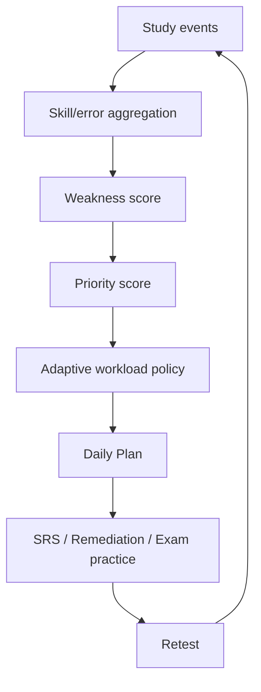

# Adaptive Algorithm

YangLingo uses an **adaptive rule-based learning engine**. It is deterministic, explainable and testable; it is not a machine-learning model.

## Inputs

- SRS due/overdue count and relearning state
- recent recall retention/accuracy when available
- mistake frequency and `RECURRED` mistakes
- weak-skill severity grouped from structured mistakes
- SRS stability/correct streak/mastery signals
- exam relevance (TOEIC/Aptis)
- recency of errors

## Processing pipeline



## Workload policy

`AdaptiveLearningService::workloadPolicy()` enforces review-first behavior:

- Due `< 20`: normal new-content allowance, normally 10–15 items.
- Due `20–50`: reduce new content to 5–8 items.
- Due `> 50`: review-first; at most 0–3 new items.
- Retention `< 70%`: reduce the current new-item allowance by 50%.
- Retention `> 85%` with low backlog: allow a small increase, capped at 15.

## Priority score

The current explainable score in `AdaptiveLearningService::priorityScore()` is:

```text
3 × error_frequency
+ 4 × recurrence_count
+ 0.08 × weakness_severity
+ 2 × overdue_weight
+ 3 × relearning_weight
+ exam_relevance
+ recency_weight
- 0.04 × mastery
```

The weights are product rules, not learned parameters. Recurrence is intentionally weighted strongly because a previously resolved concept that fails again is stronger evidence than a single recent error.

## Daily Plan priority

1. SRS due / overdue
2. Relearning
3. Unresolved and recurred mistakes
4. Weak skill practice
5. Hard cards
6. Listening recognition
7. TOEIC/Aptis practice
8. Grammar / sentence patterns / collocations
9. New vocabulary

Each plan item has a learner-facing `reason` so the UI can answer “Why is this in today’s plan?”.

## Outputs

- Daily Plan and estimated workload
- weak-skill list and priority score
- mistake-remediation practice
- SRS review recommendations
- exam-practice recommendations
- Knowledge Map/profile signals

## Edge cases

- **New user / no attempts:** percentages are not fabricated; UI shows “Chưa đủ dữ liệu” and starts with a conservative learning plan.
- **Very high backlog:** new content is throttled aggressively.
- **All skills strong:** plan falls back to SRS maintenance, listening and controlled new content.
- **Long absence:** overdue SRS dominates the plan.
- **Resolved mistake occurs again:** status becomes `RECURRED`, increasing weakness/priority.
- **Insufficient data for a skill:** it is not reported as 0%; it remains unknown until evidence exists.

## Determinism

Given the same stored learning state, `AdaptiveLearningService` returns the same workload and priority scores. Randomness may be used only for presentation details such as option order, not for core learning decisions.
