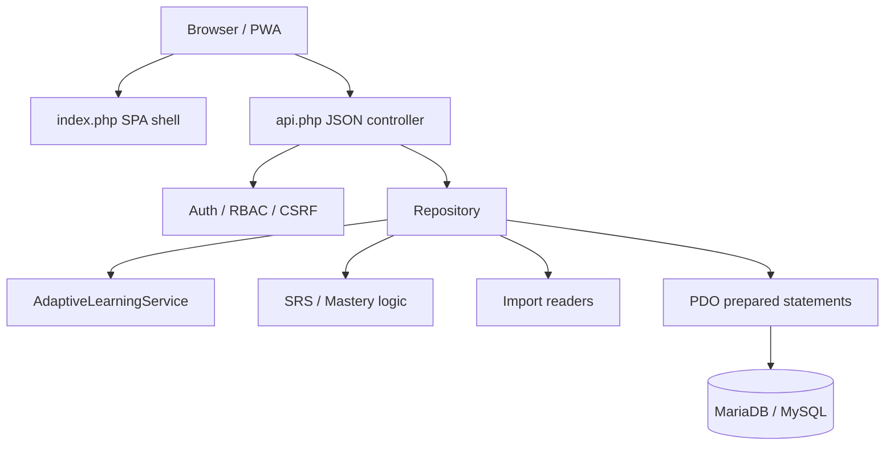
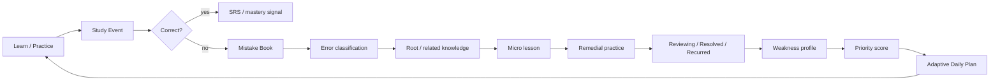

# Architecture

YangLingo is deliberately optimized for shared PHP/MySQL hosting rather than architectural complexity for its own sake.

## Learning pipeline

## Core boundaries

### Browser/PWA
`assets/app.js` owns the main SPA routes, `adaptive.js` owns Knowledge Map/Knowledge Hub interactions, and `aptis-v5.js` owns Aptis task rendering, productive-skill timers, local writing drafts and local Speaking recording. The service worker provides an offline shell, not an offline copy of authenticated API data.

### API controller
`api.php` validates authentication/method/CSRF constraints and delegates learner/admin operations. It does not expose answer keys before graded submission for protected practice paths.

### Repository
`Repository.php` remains the main persistence/application-data layer. A large final refactor was intentionally avoided because regression stability has higher priority. Independent adaptive scoring/workload logic is already extracted into `AdaptiveLearningService.php`.

### AdaptiveLearningService
Pure deterministic functions calculate workload and priority from backlog, retention, errors, recurrence, weakness, exam relevance and mastery. This separation makes the algorithm testable without a MariaDB driver.

### Database/content lifecycle
- `database/schema.sql`: base application schema.
- `database/migrations/`: additive versioned schema/history changes tracked in `schema_migrations` with checksums.
- `database/seeds/`: global curriculum/exam content tracked separately in `content_seeds`.
- global learning content is shared; user-specific progress remains in SRS/attempt/mistake tables.

## Knowledge linking

`knowledge_item_links` stores relational links between `global_learning_items`. Topic-based fallback is used when an explicit edge is unavailable. This provides graph-like traversal without requiring a graph database.

## Exam engines

TOEIC and Aptis use their own question/attempt tables but feed the same Mistake Book, Weakness and Daily Plan flow. Aptis question media is stored as lightweight paths in `aptis_question_media`; Speaking recordings stay local in the browser by default.

## Deployment

Production runtime is PHP + Apache + MariaDB/MySQL. Node.js is used only during development for syntax checking. No Docker, Redis, Python service or persistent Node process is required.
