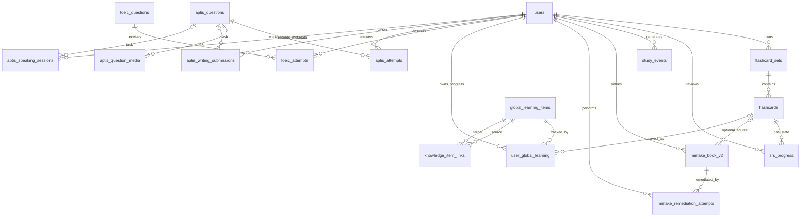

# Database ERD

This diagram is based on tables declared in `database/schema.sql` and active migrations. It focuses on the learning/adaptive path rather than listing every legacy admin helper table.

## Key tables

### Base learning
- `users`: account/RBAC identity.
- `flashcard_sets`, `flashcards`: learner-owned flashcard content.
- `srs_progress`: interval/stability/repetition state by user/card.
- `study_events`: learning activity events used for plans/analytics.

### Error remediation
- `mistake_book_v2`: structured wrong-answer record, error type/topic, recurrence and mastery status.
- `mistake_remediation_attempts`: learner attempts on targeted remedial questions.

### Global curriculum
- `global_learning_items`: shared vocabulary/collocation/pattern/grammar/listening/paraphrase content with `external_key` and `content_hash` uniqueness.
- `user_global_learning`: per-user exposure/progress and optional saved SRS card.
- `knowledge_item_links`: many-to-many related-knowledge edges; source and target both reference `global_learning_items`.

### TOEIC
- `toeic_questions`: question bank.
- `toeic_attempts`: per-user attempt history.

### Aptis
- `aptis_questions`: module/type-based question/prompt bank.
- `aptis_attempts`: graded auto-practice history.
- `aptis_question_media`: local/external media paths by question role (`image`, `image_a`, `image_b`).
- `aptis_writing_submissions`: text, word count, self-rubric summary/notes.
- `aptis_speaking_sessions`: duration/self-rubric summary/notes; raw audio is not uploaded by default.

## Referential-integrity strategy

User-owned progress/attempt rows generally cascade on user deletion. Historical exam questions are retired with `is_active=0` rather than deleted so existing attempts remain valid. Related-knowledge edges cascade when a global content item is removed.
