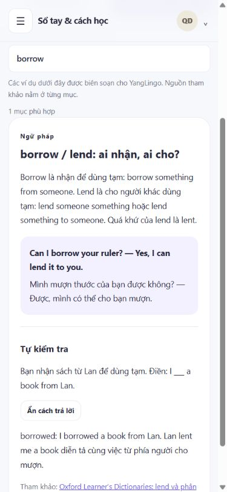

# Sổ tay & cách học

Mở **Sổ tay & cách học** trong menu. Phần này giúp lưu một điểm hay quên cùng câu tự viết; không thay lịch ôn flashcard.

## Ghi một điểm cần nhớ

1. Chọn **Ghi chú mới**, đặt tiêu đề ngắn như `borrow / lend`.
2. Chọn nhóm từ vựng, cụm/câu, ngữ pháp, nghe hoặc ghi chú khác.
3. Viết điều mình nhầm và cách sửa. Thêm một câu của mình nếu muốn.
4. Ghim vài ghi chú cần xem trước. Dùng **Lưu trữ** khi đã quen; chọn **Đã lưu trữ** để khôi phục.

Tìm kiếm xét tiêu đề, nội dung và câu tự viết. Các ký hiệu `%`, `_`, `!` được tìm như chữ thật. Mỗi trang có tối đa 20 ghi chú; ghi chú ghim nằm trước.

## Học theo một bước nhỏ

Tab **Cách học & tra nhanh** có tám mục: buổi học nhỏ, tự kiểm tra và ôn giãn cách, nghe rồi thử viết, cách ghi sổ tay, a/an, danh từ không đếm được, say/tell và borrow/lend. Có tìm kiếm, ví dụ Anh–Việt và câu tự kiểm tra. Thử trả lời trước khi bấm **Xem cách trả lời**.

Các hướng dẫn thực hành được biên soạn cho giao diện YangLingo. Những quy tắc ngữ pháp và phần tham khảo về kỹ thuật học có liên kết nguồn tại từng mục. Ví dụ và câu hỏi do dự án biên soạn; không chép bài viết hay từ điển.

## Dữ liệu và giới hạn

- Ghi chú được lưu trên máy chủ, gắn với tài khoản đăng nhập; mọi truy vấn kiểm tra chủ sở hữu. Ghi chú không được chia sẻ qua catalog book.
- POST ghi dữ liệu cần CSRF. Nội dung là văn bản, được escape khi hiển thị; không chạy HTML do người học nhập.
- Mỗi tài khoản tối đa 500 ghi chú, kể cả ghi chú lưu trữ. Tiêu đề tối đa 160 ký tự, nội dung 2.500, câu tự viết 500. Ở giới hạn này vẫn có thể sửa, ghim hoặc khôi phục ghi chú đang có.
- Ghi chú không được chấm đúng sai tự động, không tạo SRS hoặc điểm tiến bộ. Hiện chưa có xóa vĩnh viễn trong giao diện.
- Học liệu hướng dẫn có thể đọc sau khi tải giao diện; việc tải/lưu ghi chú cần kết nối và phiên đăng nhập còn hiệu lực.
- Không khẳng định ứng dụng đã được nghiên cứu đo mức tăng hiệu quả học. Người học cần điều chỉnh số từ và thời gian theo khả năng thực tế.

`database/migrations/016_learning_notebook.sql` thêm bảng riêng; không sửa các bảng book, thẻ hoặc lịch sử. `lib/LearningNotebook.php` khóa việc tạo theo người dùng để hai tab không vượt giới hạn. Dữ liệu cá nhân, cấu hình thật và bản sao lưu nằm ngoài repository.

## Viết câu từ một thẻ

Sau khi kiểm tra hoặc xem đáp án trong **Luyện nhớ & dùng từ**, chọn **Ghi câu của tôi** ngay dưới phản hồi. Bạn cũng có thể mở chi tiết thẻ trong thư viện rồi chọn thao tác này. Buổi luyện được giữ lại khi trình duyệt lưu thành công; quay lại **Luyện nhớ & dùng từ → Tiếp tục buổi luyện** để tiếp tục đúng lượt. Nếu chưa lưu được buổi luyện, ứng dụng giữ bạn tại phản hồi và báo lý do, chưa chuyển sang sổ tay. Sổ tay mở một bản nháp với từ và tham khảo ngắn từ nghĩa, ví dụ Anh–Việt. Ô **Câu của tôi** bắt đầu trống để bạn tự thử dùng từ. Sửa tham khảo hoặc thêm điều mình nhầm rồi bấm **Lưu ghi chú** khi muốn lưu.

Mở bản nháp chưa tạo ghi chú. **Hủy nháp** hoặc rời trang sẽ bỏ nội dung chưa lưu; bản nháp không được giữ qua lần tải lại. **Mở sổ tay** vẫn chỉ mở danh sách ghi chú. Các thao tác này không sửa thẻ nguồn, book, lịch ôn hay điểm tiến bộ.

Nội dung từ thẻ là tham khảo, không phải phần chấm câu tự viết. Bản nháp gắn với tài khoản và được dùng một lần. Trước khi thử lại yêu cầu lưu sau khi làm mới phiên, giao diện kiểm tra lại tài khoản, trang và đúng biểu mẫu còn mở; bản nháp của tài khoản trước không được gửi lại dưới tài khoản khác.
