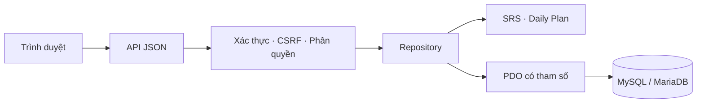

# Tổng quan YangLingo

YangLingo hỗ trợ học tiếng Anh qua flashcard, luyện nhớ, bài thi mô phỏng và kế hoạch học hằng ngày. Dự án nối học liệu với lịch ôn và lỗi đã gặp, để người học có một việc cụ thể để làm khi mở ứng dụng.

Demo: [yangcute.helioho.st](https://yangcute.helioho.st/). Người xem tự đăng ký tài khoản riêng; không có mật khẩu demo dùng chung trong mã nguồn.

## Luồng người học

1. Đăng ký hoặc đăng nhập; phiên lưu phía máy chủ.
2. Mở Thư viện, chọn book và bài ngắn. Nguồn nội dung chung tách khỏi book và tiến độ của mỗi người học.
3. Học ví dụ/cách dùng, rồi nhớ từ nghĩa Việt, điền vào câu hoặc nghe rồi viết.
4. Xem giải thích, thử lại từ chưa nhớ và dùng từ trong một lượt nói ngắn.
5. Quay lại ôn bài, tự đánh giá độ nhớ và cập nhật SRS. Daily Plan ưu tiên phần đến hạn và lỗi cần xử lý.

Book **Student English · Học tập & công việc** thêm 120 thẻ trong 12 bài: đại học, bài tập, thói quen học, làm việc nhóm, thuyết trình, email, thực tập, phỏng vấn, nơi làm việc, thời gian, ngân sách và đời sống số. Định danh nguồn riêng giúp giữ book đã có.

Buổi luyện mới cho phép chọn 5 hoặc 10 thẻ. Điểm trả lời gõ và tự đánh giá được phân biệt. Trạng thái buổi luyện lưu trong trình duyệt theo tài khoản; bài ôn SRS đi qua API hiện có. Âm thanh do trình duyệt đọc. Bài nói 30 giây của buổi luyện từ có gợi ý và đồng hồ, không thu âm hoặc chấm phát âm.

## Thiết kế kỹ thuật thể hiện trong mã nguồn

- **Frontend:** JavaScript/CSS thuần, điều hướng, trạng thái học, kiểm tra đáp án, giọng đọc và lưu cục bộ. `practice-lab.js` tách phần luyện từ khỏi giao diện chính.
- **Backend:** `api.php` là đầu vào JSON; `Repository.php` xử lý dữ liệu; `Auth.php` quản lý tài khoản/quyền; `SRS.php` và `AdaptiveLearningService.php` chứa logic lịch ôn và ưu tiên học.
- **Dữ liệu:** schema, migration và seed tách thư mục. Nội dung nền dùng chung; lịch sử làm bài, lỗi và SRS gắn với người học. Checksum phát hiện tệp đã áp dụng bị thay đổi.
- **Nội dung và import:** book ở `assets/flashbooks/`; bộ đọc TXT/CSV/XLSX/DOCX và mẫu import hỗ trợ thêm học liệu. Archive có giới hạn kích thước và kiểm tra đường dẫn.
- **Triển khai:** PHP 8+ và MySQL/MariaDB phù hợp shared hosting. PWA cung cấp giao diện ngoại tuyến; không cache API cần đăng nhập.

Đây là phạm vi có thể kiểm tra trong repository. Dự án không đưa ra tuyên bố về số người dùng, doanh thu, tăng trưởng hoặc mức cải thiện điểm thi.

## Quy tắc học và giới hạn

Daily Plan dùng quy tắc xác định từ thẻ đến hạn, bài tồn, độ nhớ gần đây và lỗi lặp lại. Hệ thống chưa có mô hình học máy được huấn luyện từ dữ liệu người dùng. SRS dùng mức tự đánh giá để tính lần ôn tiếp theo; Mistake Book và điểm yếu dùng sự kiện học thực tế.

Kiểm tra tự động xác minh hành vi phần mềm, chưa chứng minh hiệu quả giáo dục ở một nhóm người học. Speaking/Writing tự đánh giá không phải điểm TOEIC/Aptis chính thức. Mức A2–B1 của book mới là gợi ý biên soạn.

`Repository.php` và `app.js` còn có thể chia nhỏ thêm. Nghe bằng giọng tổng hợp phụ thuộc hỗ trợ trình duyệt/thiết bị. AIClient là tích hợp tùy chọn; học và luyện cốt lõi hoạt động khi không có khóa AI.

## Tài khoản và cấu hình

Ứng dụng dùng password hashing, giới hạn đăng nhập sai, đổi định danh phiên sau xác thực, cookie HttpOnly/SameSite và Secure khi HTTPS. API kiểm tra đăng nhập, quyền quản trị, quyền sở hữu và CSRF cho thao tác thay đổi. Truy vấn dùng PDO có tham số; lỗi bất ngờ ghi log và trả thông báo chung.

Source công khai chỉ có cấu hình mẫu. Cấu hình thật, log, trạng thái cài đặt, dữ liệu tải lên, backup và database export được loại và được `.gitignore` bảo vệ. Script thiết lập cũ có tài khoản cố định và lớp database cũ được bỏ khỏi bản public. Xem [manifest](PUBLIC_SOURCE_MANIFEST.json).

Bản này dành cho cài mới. Migration 009 đã ẩn định danh cá nhân và thêm điều kiện bỏ qua khi người học mẫu chưa tồn tại; không ghi đè tệp đã đổi checksum lên database đang chạy.

## Phạm vi xác minh

Cài mới bản public đã được kiểm tra trên PHP 8.0.30/PDO và MariaDB 10.4.32 với 14 migration và 12 seed, trước khi tạo tài khoản. Sau đó cài đủ 13 book, gồm Everyday English 60 thẻ và Student English 120 thẻ. Chạy lại schema/đồng bộ giữ định danh book, thẻ và SRS của dữ liệu kiểm tra đã có.

Repository còn có test nội dung, SRS, Daily Plan, import, trạng thái giao diện và audit migration/seed. Báo cáo lịch sử ghi phạm vi từng đợt kiểm tra; test phần mềm không đo kết quả học tập.

Giấy phép và xuất xứ học liệu: [CONTENT_LICENSES.md](CONTENT_LICENSES.md). Chi tiết kỹ thuật: [ARCHITECTURE.md](ARCHITECTURE.md), [ADAPTIVE_ALGORITHM.md](ADAPTIVE_ALGORITHM.md), [DATABASE_ERD.md](DATABASE_ERD.md).
